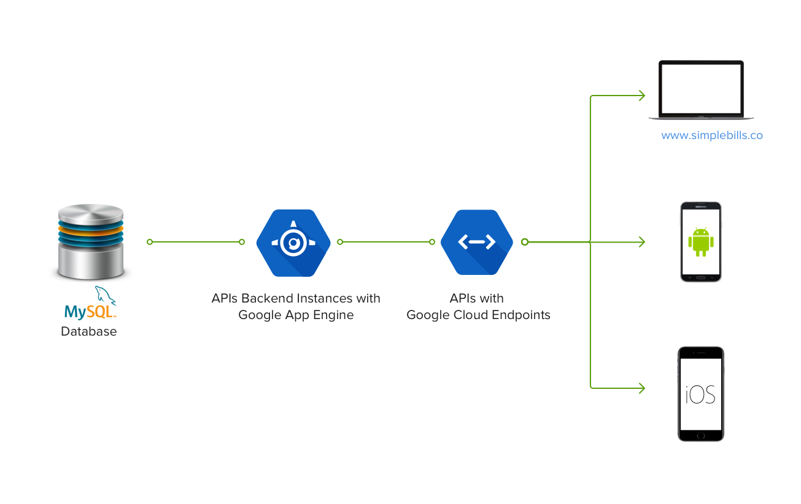

## Purpose

Simple Bills is a easy to use application to to file and archive bills digitally. We also used this opportunity to build the application using Google’s AppEngine solution.

## Architecture



We’ve taken the traditional backend and frontend approach to build Simple Bills. The backend houses all the business logic and uses a MySQL database for persistence and exposes the JSON APIs via Google Cloud Endpoints. The frontends use the APIs and implement their respective presentation logic. Currently, we’ve only build the web frontend.

We’ve implemented the frontend and backend as two AppEngine python modules - `default/crudapi` and `www`. 

## Developer Notes

Dependencies

* Install [Google Cloud SDK](https://cloud.google.com/sdk/downloads)

* Install vendor dependencies for each module’s directory - `pip install -r requirements-vendor.txt -t lib`

To run the application locally, run the following command.This starts the default service on port 8080 and the www service on port 8081

`dev_appserver.py crudapi/app.yaml web/app.yaml`

Database setup

```

$ cd crudapi

$ pip install alembic pymysql

$ mysql -u root

$ mysql> create database simple_bills;

$ alembic upgrade head

```

Caveats

* Setting up Google Cloud Storage python library - [https://cloud.google.com/appengine/docs/python/googlecloudstorageclient/setting-up-cloud-storage](https://cloud.google.com/appengine/docs/python/googlecloudstorageclient/setting-up-cloud-storage) - We chose to install the library in the lib folder.

* Running endpoints as a non default module - http://stackoverflow.com/questions/24232580/putting-a-cloud-endpoints-api-in-a-separate-app-engine-module

## Deployment

Deploying a service involves providing the environment’s relevant variables to the* appcfg.py* command. For example, to deploy the www service to AppEngine run

```

appcfg.py --no_cookies update web -E WEB_CLIENT_ID:'<INSERT WEB_CLIENT_ID>' -E WEB_CLIENT_SECRET:'<INSERT WEB_CLIENT_SECRET>' -E CRUDAPI_SERVER:’<INSERT API_SERVER>’

```

To run migrations in AppEngine

1. Update the sqlachemy.url in crudapi/alembic.ini

2. Run alembic upgrade head

## Todo

* Build an iOS application.

* Build an Android application.

